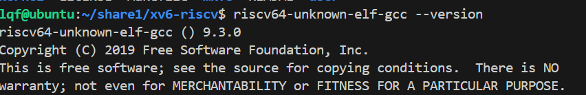
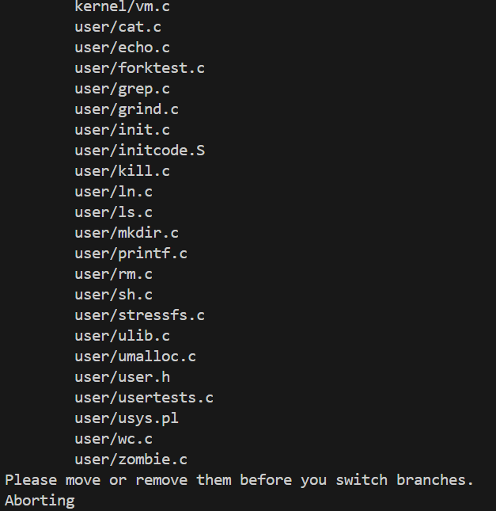
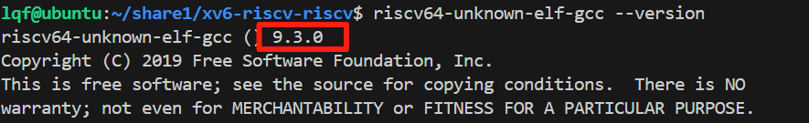
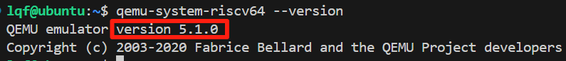
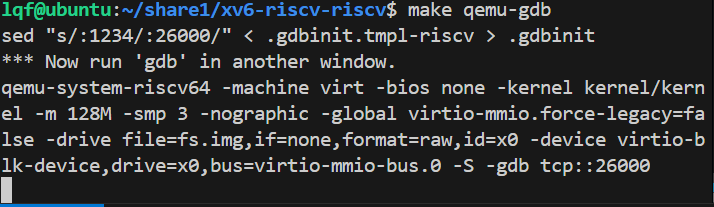
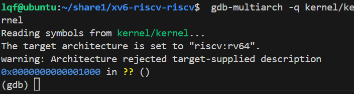

## 一、基本开发环境

- Windows 11 主机（已安装 VMWare）
- 虚拟机系统为 Ubuntu 20.04（建议使用 x86_64 架构）
- 通过 VSCode 的 Remote SSH 插件远程连接 Ubuntu
---

## 二、安装开发所需工具链

xv6 需要用到 RISC-V 交叉编译工具链。MIT 课程官方建议使用 riscv64-unknown-elf-gcc 工具链来编译 xv6-riscv。

在 Ubuntu 20.04 虚拟机中操作：


### ✨ **1. 安装所有依赖**

安装完整的 RISC-V 交叉编译器、调试器和模拟器运行所需的依赖项。

```bash
sudo apt install git build-essential gdb-multiarch gcc-riscv64-linux-gnu binutils-riscv64-linux-gnu libglib2.0-dev libpixman-1-dev ninja-build gcc-riscv64-unknown-elf
```

### ✨ **2. 下载xv6源码**

下载实验用的 xv6，这里克隆下来应该只有一份 `.git` 和 `.gitignore`，后面做对应实验切换对应分支即可
```bash
git clone git://g.csail.mit.edu/xv6-labs-2020
```

### ✨ **3. 安装 QEMU-5.1.0**

```bash
# 1. 下载指定版本的 qemu
cd ~
wget https://download.qemu.org/QEMU-5.1.0.tar.xz

# 2. 解压并进入目录
tar xvf QEMU-5.1.0.tar.xz
cd QEMU-5.1.0

# 3. 配置编译选项（仅编译 RISC-V 目标）
./configure --disable-kvm --disable-werror --prefix=/usr/local --target-list=riscv64-softmmu

# 4. 编译（启用多核加速）
make -j$(nproc)

# 5. 安装到系统
sudo make install

# 6. 验证安装
 /usr/local/bin/qemu-system-riscv64 --version
# 应输出：QEMU emulator version QEMU-5.1.0
```

### ✨ **4. 添加路径到环境变量**

```bash
echo 'export PATH="/usr/local/bin:$PATH"' >> ~/.bashrc
source ~/.bashrc
```
---

## 三、编译运行 xv6

### **3.1 进入xv6源码目录**

```bash
cd ~
cd xv6-labs-2020
```

### 3.2 设置交叉编译器路径
检查是否能直接用 gcc-riscv64-unknown-elf

我使用的是 Ubuntu 的 apt 安装方式，它默认将工具链安装到了系统路径 /usr/bin，可以直接用，不必设置 $PATH。我们可以用以下命令验证：

```bash
riscv64-unknown-elf-gcc --version
```




### 3.3 编译运行 xv6-riscv


**1. 切换到util分支：**

```bash
cd xv6-labs-2020/
git checkout util
```

- 成功：
    ```bash
    branch 'util' set up to track 'origin/util'.
    Switched to a new branch 'util'
    ```

- 失败：


  - 解决方法：临时保存当前文件，切分支后再恢复回来
    ```bash
    git add .               # 把所有已跟踪的更改加入缓存区
    git stash push -m "save before switch"   # 保存当前更改到 stash
    git clean -fd           # 删除 untracked 文件
    git checkout util       # 现在可以成功切换分支了
    ```
- 确认一下：

    ```bash
    git branch
    ```
    ```bash
    # 看到
    * util
    ```

**2. 开始编译**（Makefile 会自动使用 riscv64-unknown-elf-gcc）：

```bash
make
```

**3. 运行 xv6 系统**

```bash
make qemu
```
此时应该成功进入 xv6 shell，看到 `init: starting sh`，就没问题。

**按下ctrl+a松开两个键然后再按x退出qemu!**

---


## 四、检查工具链

```bash
riscv64-unknown-elf-gcc --version
```



```bash
qemu-system-riscv64 --version
```



## 五、检查调试工具

这里需要开启两个终端，一个运行qemu，一个运行调试器gdb。

运行qemu的窗口执行make qemu-gdb后等待gdb的连接
```bash
make qemu-gdb
```




运行调试器 gdb 的终端要进入 ~/xv6-riscv-riscv 目录下运行：

```bash
gdb-multiarch -q kernel/kernel
```



如果是第一次运行，请根据提示先设置好.gdbinit

```bash
echo set auto-load safe-path / >> ~/.gdbinit
```

环境搭建完毕！

## 六、参考

[【MIT6.S081/6.828】手把手教你搭建开发环境 - 学习，积累，成长 - 博客园 (cnblogs.com)](https://www.cnblogs.com/dongxb/p/15225223.html)