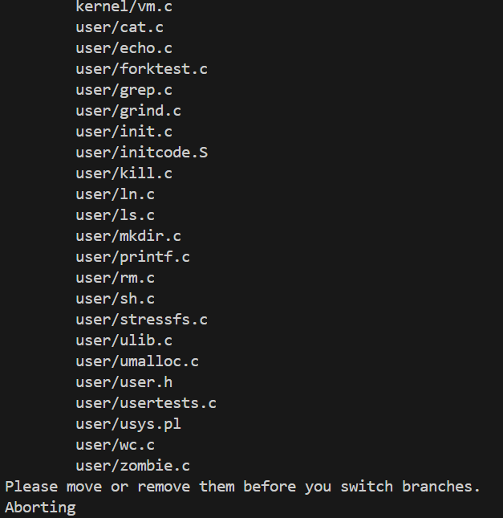

## 一、启动xv6(难度：Easy)

**1. 切换到util分支：**

```bash
cd xv6-labs-2020/
git checkout util
```

- 成功：
    ```bash
    branch 'util' set up to track 'origin/util'.
    Switched to a new branch 'util'
    ```

- 失败：


  - 解决方法：临时保存当前文件，切分支后再恢复回来
    ```bash
    git add .               # 把所有已跟踪的更改加入缓存区
    git stash push -m "save before switch"   # 保存当前更改到 stash
    git clean -fd           # 删除 untracked 文件
    git checkout util       # 现在可以成功切换分支了
    ```
- 确认一下：

    ```bash
    git branch
    ```
    ```bash
    # 看到
    * util
    ```

**2. 运行 xv6**

```bash
make qemu
```
**按下ctrl+a松开两个键然后再按x退出qemu!**

---

## 二、sleep(难度：Easy)


## 二、sleep（难度：Easy）

**1. 模仿已有程序，如 `/user/echo.c`。可以打开文件看看结构，或者运行：**

```bash
cat user/echo.c
```

可以看到它的结构大致是：

```c
#include "kernel/types.h"
#include "user/user.h"

int
main(int argc, char *argv[])
{
  // 逻辑代码
  exit(0);
}
```

**2. 现在新建 sleep 程序**

```bash
touch user/sleep.c
```

然后编辑它（推荐使用 VSCode 或 vim）：

```bash
vim user/sleep.c
```

```c
#include "kernel/types.h"
#include "user/user.h"

int main(int argc, char *argv[])
{
  if (argc != 2) {
    fprintf(2, "Usage: sleep <time>\n");
    exit(1);
  }

  int time = atoi(argv[1]);
  sleep(time);

  exit(0);
}
```

- `argc` 是参数个数，`argv[1]` 是从 shell 输入的时间。
- `atoi`：把字符串转为整数。
- `sleep(time)`：调用系统调用。
- `exit()`：程序正确退出。
    

**3. 将 sleep 添加到 Makefile**

编辑 Makefile 文件：

```bash
vim Makefile
```

找到 `UPROGS`（大概在 220 行附近），**在末尾加上：**

```make
  $U/_sleep\
```

**4. 编译并运行测试**

```bash
make qemu
```

如果编译没有报错，进入 shell 后测试：

```bash
sleep 10
```

程序会暂停一会儿然后退出，说明成功。

**5. 自动化测试 sleep 程序**

退出 qemu（在 qemu 窗口按 `Ctrl+A`，然后 `X` 退出），然后运行：

```bash
./grade-lab-util sleep
```

或者：

```bash
make GRADEFLAGS=sleep grade
```
---

## 三、pingpong（难度：Easy）

用**管道 pipe**和**fork 子进程**实现父子进程之间的通信：
- 父进程发送“ping”
- 子进程收到“ping”后回应“pong”
- 父进程收到“pong”后退出

```bash
touch user/pingpong.c
```

```c
#include "kernel/types.h"
#include "user/user.h"

#define RD 0  // 管道读端
#define WR 1  // 管道写端

int main(int argc, char const *argv[]) {
    // 验证参数数量
    if (argc > 1) {
        fprintf(2, "Usage: pingpong (no arguments needed)\n");
        exit(1);
    }

    char buf = 'P';  // 用于在进程间传递的字节

    // 创建两个管道：
    int fd_c2p[2];
    int fd_p2c[2];

    if (pipe(fd_c2p) < 0 || pipe(fd_p2c) < 0) {
        fprintf(2, "pipe creation failed\n");
        exit(1);
    }

    int pid = fork();  // 创建子进程
    int exit_status = 0;  // 退出状态码

    if (pid < 0) {
        fprintf(2, "fork() failed!\n");
        
        close(fd_c2p[RD]);
        close(fd_c2p[WR]);
        close(fd_p2c[RD]);
        close(fd_p2c[WR]);
        exit(1);
    } else if (pid == 0) {  // 子进程
        // 关闭不需要的管道端点:
        close(fd_p2c[WR]);  
        close(fd_c2p[RD]); 

        // 1. 从父进程读取数据
        int nread = read(fd_p2c[RD], &buf, sizeof(char));
        if (nread != sizeof(char)) {
            if (nread < 0) {
                fprintf(2, "child read() error!\n");
            } else {
                fprintf(2, "child read() incomplete\n");
            }
            exit_status = 1;
        } else {
            // 成功读取后打印消息
            fprintf(1, "%d: received ping\n", getpid());
        }

        // 2. 将数据写回父进程
        if (write(fd_c2p[WR], &buf, sizeof(char)) != sizeof(char)) {
            fprintf(2, "child write() error!\n");
            exit_status = 1;
        }

        // 关闭剩余管道端点
        close(fd_p2c[RD]);
        close(fd_c2p[WR]);

        exit(exit_status);  // 子进程退出
    } else {  // 父进程

        close(fd_p2c[RD]);
        close(fd_c2p[WR]);

        // 1. 向子进程发送数据
        if (write(fd_p2c[WR], &buf, sizeof(char)) != sizeof(char)) {
            fprintf(2, "parent write() error!\n");
            exit_status = 1;
        }

        // 2. 等待子进程的回复
        int nread = read(fd_c2p[RD], &buf, sizeof(char));
        if (nread != sizeof(char)) {
            if (nread < 0) {
                fprintf(2, "parent read() error!\n");
            } else {
                fprintf(2, "parent read() incomplete\n");
            }
            exit_status = 1;
        } else {
            // 成功读取后打印消息
            fprintf(1, "%d: received pong\n", getpid());
        }

        // 关闭剩余管道端点
        close(fd_p2c[WR]);
        close(fd_c2p[RD]);

        // 等待子进程结束
        wait(0);
        
        exit(exit_status);  // 父进程退出
    }
}
```

```make
UPROGS=\
	...
	$U/_pingpong\
```

- 编译运行
```bash
make qemu
pingpong
```

- 退出 qemu，shell 测试结果
```bash
./grade-lab-util pingpong
```
---


## 四、primes（素数，难度：Moderate/Hard）

使用 **多进程+管道** 的方式进行实现与“埃拉托色尼筛法”类似的“质数筛选器”。核心思想如下：

**1. 主进程写入初始数据 2~35** 到管道中。
**2. 子进程开始处理筛选流程**：
- 从管道读取第一个数，**这个数就是当前的素数**。
- 打印这个素数。
- 创建新管道 + 新进程，处理后续筛选。
**3. 筛选逻辑**：
- 当前进程继续从旧管道读取剩余数。
- 只将**不能被当前素数整除**的数写入新管道。
- 子进程从新管道继续处理下一个素数，重复上述过程（递归 + 新进程）。

```c
#include "kernel/types.h"
#include "user/user.h"

#define RD 0  // 管道读端
#define WR 1  // 管道写端

/**
 * @brief 读取左边管道的第一个数（应该是素数），打印它
 * @param left 左边传入数据的管道
 * @param prime 存储读到的第一个数
 * @return 成功返回0，失败返回-1
 */
int read_first(int left[2], int *prime) {
  if (read(left[RD], prime, sizeof(int)) == sizeof(int)) {
    printf("prime %d\n", *prime);
    return 0;
  }
  return -1;
}

/**
 * @brief 从左边读取数据，筛选出不能被 prime 整除的数，传到右边
 * @param left 输入管道
 * @param right 输出管道
 * @param prime 当前的素数，用于筛选
 */
void filter_and_pass(int left[2], int right[2], int prime) {
  int num;
  while (read(left[RD], &num, sizeof(int)) == sizeof(int)) {
    if (num % prime != 0) {
      write(right[WR], &num, sizeof(int));
    }
  }
  // 所有数据处理完后，关闭两端
  close(left[RD]);
  close(right[WR]);
}

/**
 * @brief 递归地处理素数筛选
 * @param left 输入管道
 */
void primes(int left[2]) {
  close(left[WR]); // 当前进程只读，不写
  int prime;

  // 读取当前管道的第一个数
  if (read_first(left, &prime) == 0) {
    int right[2];
    pipe(right); // 创建下一个进程用的管道

    // 过滤不能被 prime 整除的数，写入右边管道
    filter_and_pass(left, right, prime);

    // 创建子进程处理下一个筛选
    if (fork() == 0) {
      primes(right); // 子进程继续处理
    } else {
      close(right[RD]); // 父进程不读了
      wait(0);          // 等待子进程结束
    }
  }

  exit(0);
}

int main() {
  int pipe_fd[2];
  pipe(pipe_fd);

  // 写入 2~35 到管道
  for (int i = 2; i <= 35; i++) {
    write(pipe_fd[WR], &i, sizeof(int));
  }

  // 创建子进程开始处理素数筛选
  if (fork() == 0) {
    primes(pipe_fd);
  } else {
    // 父进程关闭读写并等待
    close(pipe_fd[WR]);
    close(pipe_fd[RD]);
    wait(0);
  }

  exit(0);
}
```

---


## 五、find（难度：Moderate）

参考 `user/ls.c`：

- 如果不给参数，就列出当前目录的所有文件信息；
- 如果给了路径参数，就列出这些路径对应的文件或目录下的内容；
- 对于目录，会列出其内部的每个文件/子目录的基本信息。

实现 `find.c`：

```c
#include "kernel/types.h"
#include "kernel/fs.h"
#include "kernel/stat.h"
#include "user/user.h"

/**
 * @brief 递归查找指定目录下名称与给定文件名匹配的文件
 *
 * @param path      要搜索的起始目录路径（必须是目录）
 * @param filename  要查找的目标文件名（仅文件名，不包含路径）
 *
 * 本函数会：
 * 1. 遍历 path 下所有的文件与子目录；
 * 2. 遇到子目录时递归进入；
 * 3. 如果当前文件的名称与 filename 匹配，则打印其完整路径。
 */
void find(char *path, const char *filename)
{
  char buf[512], *p;
  int fd;
  struct dirent de;
  struct stat st;

  // 打开目录
  if ((fd = open(path, 0)) < 0) {
    fprintf(2, "find: cannot open %s\n", path);
    return;
  }

  // 获取目录信息
  if (fstat(fd, &st) < 0) {
    fprintf(2, "find: cannot fstat %s\n", path);
    close(fd);
    return;
  }

  // 如果 path 不是目录，则说明使用方式错误
  if (st.type != T_DIR) {
    fprintf(2, "usage: find <DIRECTORY> <filename>\n");
    close(fd);
    return;
  }

  // 检查路径拼接后是否过长
  if (strlen(path) + 1 + DIRSIZ + 1 > sizeof buf) {
    fprintf(2, "find: path too long\n");
    close(fd);
    return;
  }

  // 构造路径前缀（例如 /a -> /a/）
  strcpy(buf, path);
  p = buf + strlen(buf);
  *p++ = '/';

  // 遍历目录项
  while (read(fd, &de, sizeof de) == sizeof de) {
    if (de.inum == 0)
      continue;

    // 构造完整路径名
    memmove(p, de.name, DIRSIZ);
    p[DIRSIZ] = 0;

    // 获取当前路径的 stat 信息
    if (stat(buf, &st) < 0) {
      fprintf(2, "find: cannot stat %s\n", buf);
      continue;
    }

    // 如果是子目录且不是 "." 或 ".."，递归进入
    if (st.type == T_DIR && strcmp(p, ".") != 0 && strcmp(p, "..") != 0) {
      find(buf, filename);
    }
    // 如果是文件名匹配，输出路径
    else if (strcmp(filename, p) == 0) {
      printf("%s\n", buf);
    }
  }

  close(fd);
}

/**
 * @brief 程序入口：处理参数并调用 find()
 *
 * @param argc 参数个数，必须为 3
 * @param argv 参数数组，格式应为：find <directory> <filename>
 *
 * 参数说明：
 * argv[1]：要查找的目录路径
 * argv[2]：要查找的文件名
 */
int main(int argc, char *argv[])
{
  if (argc != 3) {
    fprintf(2, "usage: find <directory> <filename>\n");
    exit(1);
  }

  find(argv[1], argv[2]);
  exit(0);
}

```


```make
UPROGS=\
	...
	$U/_find\
```

- 编译运行
```bash
make qemu
echo > b
mkdir a
echo > a/b
find . b
```
- `echo > b`：创建一个名为 `b` 的空文件，`echo` 默认会输出一个空行（就是换行符 `\n`），这条命令相当于 `echo "" > b`
- `mkdir a`：当前目录下创建一个名为 `a` 的目录
- `echo > a/b`：在 `a` 目录下创建一个名为 `b` 的文件

- 测试结果
```bash
./b
./a/b
```

- 退出 qemu，shell 测试结果
```bash
./grade-lab-util find
```
---


## 六、xargs（难度：Moderate）

**题目：**

在 Linux / Unix 中，`xargs` 是一个命令行工具，它的作用是：

>读取标准输入的内容，把它作为命令行参数追加到一个指定的命令后面执行。

举个简单的例子：
```bash
echo hello too | xargs echo bye
```
- `echo hello too`：输出 `hello too`
- 这输出被管道 `|` 传给了 `xargs`
- `xargs` 的作用是接收这行内容，作为参数追加到后面这个命令：`echo bye`

所以最终执行的命令是：
```bash
echo bye hello too
```

我们你要在 **xv6** 这个简化版的 UNIX 系统里，**手动实现一个简化的 `xargs` 程序**：
	
- 读取标准输入，一行一行地读（每行用 `\n` 结尾）
- 把这一行作为参数追加到指定的命令后面
- 然后执行这个命令
- 每一行执行一次

也就是：

```bash
xargs <command> [command_args...]
```

示例：

```bash
echo "1\n2" | xargs echo line
```
- 从标准输入读取两行：`1` 和 `2`
- 对每一行都执行命令：`echo line 行内容`
- 所以最终执行：
    - `echo line 1`
    - `echo line 2`
- 输出：
	```bash
	line 1
	line 2
	```

**流程：**
```c
标准输入（read）→ FSM 状态判断 → 参数提取 → 换行则 fork + exec 执行 → 等待完成 → 下一行继续
```

| 状态名              | 说明                                  |
| ---------------- | ----------------------------------- |
| `S_WAIT`         | 等待下一个参数开始，遇到空格/换行跳过；遇到字符转为 `S_ARG`。 |
| `S_ARG`          | 正在读取一个参数，继续往后读取；遇到空格表示参数结束。         |
| `S_ARG_END`      | 参数读取完毕，将参数起始地址加入 `x_argv`。          |
| `S_ARG_LINE_END` | 参数读取完且遇到换行，加入参数后立即执行命令。             |
| `S_LINE_END`     | 换行在空格后，表示没有新参数，仅执行一次命令。             |
| `S_END`          | 输入结束。                               |


**代码：**

```c
#include "kernel/types.h"
#include "user/user.h"
#include "kernel/param.h"

#define MAXSZ 512
// 有限状态自动机状态定义
enum state {
  S_WAIT,         // 等待参数输入，此状态为初始状态或当前字符为空格
  S_ARG,          // 参数内
  S_ARG_END,      // 参数结束
  S_ARG_LINE_END, // 左侧有参数的换行，例如"arg\n"
  S_LINE_END,     // 左侧为空格的换行，例如"arg  \n""
  S_END           // 结束，EOF
};

// 字符类型定义
enum char_type {
  C_SPACE,
  C_CHAR,
  C_LINE_END
};

/**
 * @brief 获取字符类型
 *
 * @param c 待判定的字符
 * @return enum char_type 字符类型
 */
enum char_type get_char_type(char c)
{
  switch (c) {
  case ' ':
    return C_SPACE;
  case '\n':
    return C_LINE_END;
  default:
    return C_CHAR;
  }
}

/**
 * @brief 状态转换
 *
 * @param cur 当前的状态
 * @param ct 将要读取的字符
 * @return enum state 转换后的状态
 */
enum state transform_state(enum state cur, enum char_type ct)
{
  switch (cur) {
  case S_WAIT:
    if (ct == C_SPACE)    return S_WAIT;
    if (ct == C_LINE_END) return S_LINE_END;
    if (ct == C_CHAR)     return S_ARG;
    break;
  case S_ARG:
    if (ct == C_SPACE)    return S_ARG_END;
    if (ct == C_LINE_END) return S_ARG_LINE_END;
    if (ct == C_CHAR)     return S_ARG;
    break;
  case S_ARG_END:
  case S_ARG_LINE_END:
  case S_LINE_END:
    if (ct == C_SPACE)    return S_WAIT;
    if (ct == C_LINE_END) return S_LINE_END;
    if (ct == C_CHAR)     return S_ARG;
    break;
  default:
    break;
  }
  return S_END;
}


/**
 * @brief 将参数列表后面的元素全部置为空
 *        用于换行时，重新赋予参数
 *
 * @param x_argv 参数指针数组
 * @param beg 要清空的起始下标
 */
void clearArgv(char *x_argv[MAXARG], int beg)
{
  for (int i = beg; i < MAXARG; ++i)
    x_argv[i] = 0;
}

int main(int argc, char *argv[])
{
  if (argc - 1 >= MAXARG) {
    fprintf(2, "xargs: too many arguments.\n");
    exit(1);
  }
  char lines[MAXSZ];
  char *p = lines;
  char *x_argv[MAXARG] = {0}; // 参数指针数组，全部初始化为空指针

  // 存储原有的参数
  for (int i = 1; i < argc; ++i) {
    x_argv[i - 1] = argv[i];
  }
  int arg_beg = 0;          // 参数起始下标
  int arg_end = 0;          // 参数结束下标
  int arg_cnt = argc - 1;   // 当前参数索引
  enum state st = S_WAIT;   // 起始状态置为S_WAIT

  while (st != S_END) {
    // 读取为空则退出
    if (read(0, p, sizeof(char)) != sizeof(char)) {
      st = S_END;
    } else {
      st = transform_state(st, get_char_type(*p));
    }

    if (++arg_end >= MAXSZ) {
      fprintf(2, "xargs: arguments too long.\n");
      exit(1);
    }

    switch (st) {
    case S_WAIT:          // 这种情况下只需要让参数起始指针前移
      ++arg_beg;
      break;
    case S_ARG_END:       // 参数结束，将参数地址存入x_argv数组中
      x_argv[arg_cnt++] = &lines[arg_beg];
      arg_beg = arg_end;
      *p = '\0';          // 替换为字符串结束符
      break;
    case S_ARG_LINE_END:  // 将参数地址存入x_argv数组中同时执行指令
      x_argv[arg_cnt++] = &lines[arg_beg];
      // 不加break，因为后续处理同S_LINE_END
    case S_LINE_END:      // 行结束，则为当前行执行指令
      arg_beg = arg_end;
      *p = '\0';
      if (fork() == 0) {
        exec(argv[1], x_argv);
      }
      arg_cnt = argc - 1;
      clearArgv(x_argv, arg_cnt);
      wait(0);
      break;
    default:
      break;
    }

    ++p;    // 下一个字符的存储位置后移
  }
  exit(0);
}

```

状态转化图解：

|当前状态|读取字符类型|下一个状态|说明|
|---|---|---|---|
|`S_WAIT`|空格|`S_WAIT`|忽略空格，继续等待参数|
|`S_WAIT`|字符|`S_ARG`|参数开始|
|`S_WAIT`|换行|`S_LINE_END`|空行（没有参数），准备执行|
|`S_ARG`|字符|`S_ARG`|参数中继续读取|
|`S_ARG`|空格|`S_ARG_END`|参数结束了|
|`S_ARG`|换行|`S_ARG_LINE_END`|参数结束且这一行也结束了|
|`S_ARG_END`|空格|`S_WAIT`|继续等待下一个参数|
|`S_ARG_END`|字符|`S_ARG`|下一个参数开始|
|`S_ARG_END`|换行|`S_LINE_END`|参数结束并且行结束|
|`S_ARG_LINE_END`|任意|…|直接进入 `S_LINE_END` 执行命令|
|`S_LINE_END`|任意|看字符而定|状态清零后判断是否开始下一行|